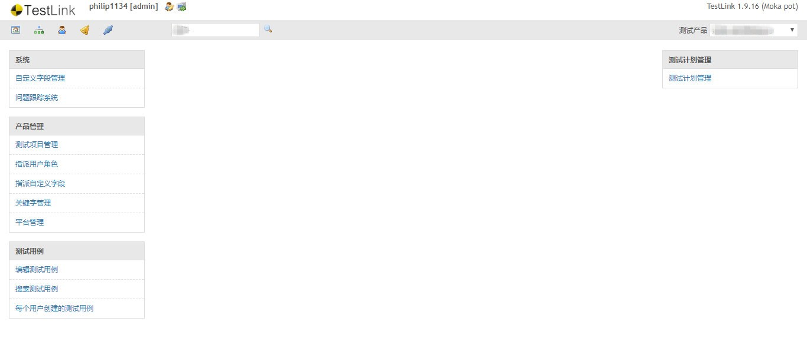
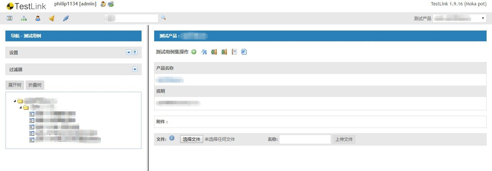
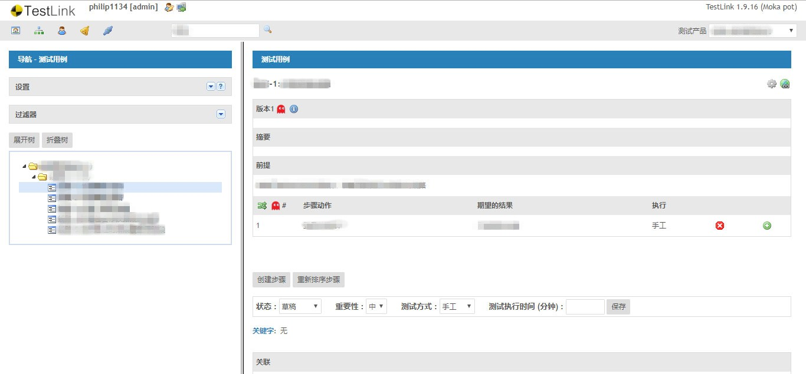

TestLink Customized Theme - GraySkin / based on TestLink 1.9.16 Moka Pot

-----

already set config.inc.php

$tlCfg->theme_dir = 'gui/themes/grayskin/';

------

# PREVIEW

- home page

- testsuite

- testcase

-----

# REF

testlink source: https://github.com/TestLinkOpenSourceTRMS/testlink-code

